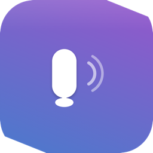

# 🎙️ LocalVoice 本地语音 — Local LLM Voice Input for macOS

**LocalVoice 本地语音** is a **privacy-first, offline voice input app** for macOS that runs **100% locally on Apple Silicon** using **MLX + Qwen3-ASR**. No cloud, no data leaving your Mac.

[](LICENSE)
[](https://developer.apple.com/macos)
[](https://www.apple.com/mac/)
[](https://github.com/ml-explore/mlx)

---

## ✨ Features

- **🤖 Local MLX Inference** — Qwen3-ASR 0.6B (快速) or 1.7B (推荐) runs natively on Apple Silicon via MLX (0.6B: 6-bit quantized, 1.7B: 5-bit quantized)
- **🔒 100% Offline & Private** — Zero network calls during transcription. Your voice never leaves your Mac.
- **🎤 Push-to-Talk** — Hold Fn/Globe key (or custom hotkey) → speak → release → text appears
- **🌐 Bilingual** — Seamless Chinese + English mixed-language recognition
- **📝 Universal Text Injection** — AXUIElement for native apps + clipboard fallback for Electron/WebView apps
- **✍️ AI Text Rewriting** — Smart rewriting of transcribed text using local LLM
- **⚡ Fast** — 6-12× realtime on M-series chips
- **📦 Dual-Model, Multi-Source** — Choose 0.6B (~860MB) or 1.7B (~1.8GB); download from HuggingFace, HF Mirror, or ModelScope
- **🌍 Localized UI** — English + 中文 (中文) interface
- **🔄 Login Item Ready** — Auto-start on boot

## 🖥️ Screenshots



*Welcome / Permissions / Settings / Recording*

## 🚀 Quick Start

### Requirements

- macOS 14 (Sonoma) or later
- Apple Silicon (M1/M2/M3/M4)
- ~1.5GB free RAM (0.6B model) or ~3.5GB (1.7B model)
- ~860MB free disk space (0.6B model) or ~1.8GB (1.7B model)

### Installation

#### Option 1: Download DMG (Recommended)

Download `LocalVoice.dmg` from the [Releases page](https://github.com/localvoice/local-llm-voice-input/releases).
Open the DMG, drag `LocalVoice.app` to `Applications`.

> ⚠️ **First launch**: macOS Gatekeeper may block the app ("unverified developer").
> **Right-click the app → Open**, then click "Open" in the dialog. This only needs to be done once.
> Or run in Terminal: `xattr -dr com.apple.quarantine /Applications/LocalVoice.app`

#### Option 2: Clone + Build

```bash
git clone https://github.com/localvoice/local-llm-voice-input.git
cd local-llm-voice-input
./build.sh
```

Then run from `~/Applications/LocalVoice.app`.

### First Run

1. Launch **LocalVoice** from `~/Applications`
2. The **Welcome Guide** will walk you through:
   - **Step 1**: Grant **Microphone** permission
   - **Step 2**: Grant **Accessibility** permission (for text injection)
   - **Step 3**: **Download a model** (Qwen3-ASR 0.6B or 1.7B)
3. Press **Fn/Globe** key → speak → release → text appears

### Permissions Required

| Permission | Purpose |
|-----------|---------|
| 🎤 Microphone | Capture your voice for transcription |
| ♿ Accessibility | Insert text into other applications |
| ⌨️ Input Monitoring | Listen for the global hotkey |

> **Why these permissions?** LocalVoice uses assistive access (AXUIElement) to type recognized speech into your current app — exactly like other dictation tools (TypeLess, MacWhisper, SuperWhisper).

## 🎯 Usage

### Basic Dictation

1. Click the microphone icon in the menu bar
2. Press and hold **Fn** (or your configured hotkey)
3. Speak naturally — English, Chinese, or mixed
4. Release the key → transcription appears in your active app

### Hotkey Configuration

Open **Settings → General** to customize your hotkey:

| Key | Type |
|-----|------|
| `Fn` / `Globe` | Default |
| `Right ⌘` | Right Command |
| `⌥ Option` | Left or Right Option |
| `Custom` | Any keycode |

### Text Injection Methods

| Method | Apps | Behavior |
|--------|------|----------|
| AXUIElement (auto) | Native macOS apps (Notes, TextEdit, Xcode, etc.) | Zero side effects |
| Clipboard + Cmd+V | Electron apps (VS Code, Slack, Discord, etc.) | Auto-fallback, restores clipboard |

Settings → Text Input to choose your preferred method.

### Model Download

Open **Settings → Model** to:

- **Download** your preferred model:

  **Qwen3-ASR 1.7B (推荐)** — High accuracy, ~1.8GB:
  - 🇺🇸 **HuggingFace** — `mlx-community/Qwen3-ASR-1.7B-5bit`
  - 🇨🇳 **HF Mirror** — `hf-mirror.com` mirror (China-friendly)
  - 🇨🇳 **ModelScope** — `modelscope.cn` mirror (China-optimized)

  **Qwen3-ASR 0.6B (快速)** — Lightweight, ~860MB:
  - 🇺🇸 **HuggingFace** — `mlx-community/Qwen3-ASR-0.6B-6bit`
  - 🇨🇳 **HF Mirror** — `hf-mirror.com` mirror (China-friendly)
  - 🇨🇳 **ModelScope** — `modelscope.cn` mirror (China-optimized)
- **View download progress** with per-file status
- **Delete** model to free disk space

Model storage: `~/Library/Application Support/com.vocaltype.app/models/`

### Language Settings

Open **Settings → General → Language** to switch between:

- **System** — Follows macOS language (English or 中文)
- **English** — Always English
- **中文** — Always Chinese

## 🏗️ Architecture

```
┌─────────────────────────────────────────────────┐
│                   Menu Bar App                   │
│              (LSUIElement = true)                │
├─────────────────────────────────────────────────┤
│                                                   │
│  ┌──────────┐    ┌──────────────┐                │
│  │Hotkey    │───▶│ AudioRecorder │──▶ 16kHz WAV  │
│  │Monitor   │    │ (AVAudioEng.) │                │
│  └──────────┘    └──────┬───────┘                │
│                         │                        │
│                         ▼                        │
│  ┌──────────────────────────────┐                │
│  │   TranscriptionService       │                │
│  │   ┌────────────────────┐    │                │
│  │   │  MLX (Qwen3-ASR)   │    │                │
│  │   └────────────────────┘    │                │
│  └──────────┬───────────────────┘                │
│             │                                    │
│             ▼                                    │
│  ┌──────────────────────────────┐                │
│  │      TextInjector            │                │
│  │  ┌──────────┐ ┌───────────┐ │                │
│  │  │AXUIElement│ │ Clipboard │ │                │
│  │  │ (native) │ │ (Electron)│ │                │
│  │  └──────────┘ └───────────┘ │                │
│  └──────────────────────────────┘                │
│                                                   │
│  ┌──────────────────────────────┐                │
│  │   ModelDownloadService       │                │
│  │  HF / HF Mirror / ModelScope │                │
│  └──────────────────────────────┘                │
└─────────────────────────────────────────────────┘
```

### Stack

| Layer | Technology |
|-------|-----------|
| **UI Framework** | SwiftUI 5 (macOS 14+) |
| **Language** | Swift 6 |
| **STT Backend** | MLX + Qwen3-ASR 0.6B/1.7B (0.6B: 6-bit, 1.7B: 5-bit quantized) |
| **Audio Capture** | AVAudioEngine (16kHz, 16-bit PCM) |
| **Text Injection** | AXUIElement + Clipboard (NSPasteboard) |
| **Hotkey** | CGEventTap (HID-level) |
| **Package Manager** | Swift Package Manager |

## 📦 Project Structure

```
local-llm-voice-input/
├── Sources/
│   ├── VocalTypeApp.swift          # @main — app lifecycle
│   ├── UIState.swift               # State model + engine coordinator
│   ├── MenuBarView.swift           # Menu bar dropdown
│   ├── SettingsView.swift          # Settings (4 tabs)
│   ├── WelcomeView.swift           # Welcome/onboarding guide
│   ├── PermissionsView.swift       # Permission checker window
│   ├── RecordingOverlayView.swift  # Recording floating overlay
│   ├── PermissionChecker.swift     # AVFoundation / AX / CG permission check
│   ├── HotkeyMonitor.swift         # CGEventTap hotkey listener
│   ├── AudioRecorder.swift         # 16kHz WAV recorder
│   ├── TranscriptionService.swift  # STT protocol + orchestration
│   ├── MLXTranscription.swift      # MLX transcription runner
│   ├── TextInjector.swift          # AXUIElement + clipboard fallback
│   ├── TextRewriter.swift          # AI text rewriting
│   ├── Logger.swift                # Logging utility
│   ├── ModelDownloadService.swift  # Multi-source model download engine
│   ├── LocaleService.swift         # Bilingual (EN/ZH) strings
│   ├── MLXASR/                     # MLX ASR engine
│   │   ├── Qwen3ASRConfig.swift
│   │   ├── Qwen3ASRModel.swift
│   │   ├── Qwen3ASRTokenizer.swift
│   │   ├── Qwen3ASRSTT.swift
│   │   ├── Qwen3ASRAudio.swift
│   │   └── Layers/
│   │       ├── AudioEncoder.swift
│   │       └── TextDecoder.swift
│   ├── CLI/                        # CLI interface
│   │   └── main.swift
│   ├── VocalType.entitlements
│   ├── Info.plist
│   └── Assets.xcassets/            # App icons
├── Tests/
│   └── VocalTypeTests/
│       ├── AudioRecorderTests.swift
│       ├── HotkeyMonitorTests.swift
│       ├── ModelDownloadServiceLogicTests.swift
│       ├── PermissionCheckerTests.swift
│       ├── RecordingStateTests.swift
│       ├── TestUtilities.swift
│       ├── TextInjectorTests.swift
│       └── TranscriptionIntegrationTests.swift
├── Package.swift                   # SPM manifest
├── build.sh                        # Build + install script
├── test.sh
├── test_transcribe.sh
├── scripts/
│   └── test_download.sh
├── .gitignore
└── README.md
```

## 🌐 Download Sources

### Model Sources Comparison

| Source | Region | Model | Size | Speed |
|--------|--------|-------|------|-------|
| [HuggingFace](https://huggingface.co/mlx-community/Qwen3-ASR-1.7B-5bit) | Global | 1.7B 5-bit | ~1.8 GB | ⭐⭐⭐ |
| [HF Mirror](https://hf-mirror.com/mlx-community/Qwen3-ASR-1.7B-5bit) | China-optimized | 1.7B 5-bit | ~1.8 GB | ⭐⭐⭐⭐ |
| [ModelScope](https://modelscope.cn/models/mlx-community/Qwen3-ASR-1.7B-5bit) | China-optimized | 1.7B 5-bit | ~1.8 GB | ⭐⭐⭐⭐⭐ |
| [HuggingFace](https://huggingface.co/mlx-community/Qwen3-ASR-0.6B-6bit) | Global | 0.6B 6-bit | ~860 MB | ⭐⭐⭐⭐⭐ |
| [HF Mirror](https://hf-mirror.com/mlx-community/Qwen3-ASR-0.6B-6bit) | China-optimized | 0.6B 6-bit | ~860 MB | ⭐⭐⭐⭐⭐ |
| [ModelScope](https://modelscope.cn/models/mlx-community/Qwen3-ASR-0.6B-6bit) | China-optimized | 0.6B 6-bit | ~860 MB | ⭐⭐⭐⭐⭐ |

### Which source should I use?

- **Global users**: HuggingFace (direct, most reliable)
- **Mainland China**: ModelScope (fastest, CDN-optimized) or HF Mirror
- **Fallback**: Any source — the app auto-detects the correct API

## ❓ FAQ

### Q: Is this like TypeLess / 闪电说 / MacWhisper?
**Yes.** LocalVoice follows the same menu-bar-app pattern used by all major dictation tools. It does NOT replace your system input method — it works alongside your existing Chinese/English IME.

### Q: Why not use Apple's built-in dictation?
Apple's dictation sends audio to Apple servers for processing. LocalVoice processes everything on-device with no network calls.

### Q: What model does it use?
**Qwen3-ASR-0.6B (快速)** and **Qwen3-ASR-1.7B (推荐)** — the 0.6B is 6-bit quantized (~860MB), the 1.7B is 5-bit quantized (~1.8GB). Both support 30+ languages including Chinese + English mixed recognition.

### Q: Can I use a different model?
Pre-configured for Qwen3-ASR 0.6B (6-bit) and 1.7B (5-bit). The architecture supports multiple engines — see the `STTEngine` enum in `UIState.swift` for future expansion.

### Q: How much RAM does it use?
~1.5 GB for 0.6B model or ~3.5 GB for 1.7B model (the model loads into memory and stays resident).

### Q: Does it work without internet?
**Yes.** Once the model is downloaded, 100% offline. No network connectivity required.

### Q: How is text inserted into apps?
Two methods:
1. **AXUIElement** (primary, zero side effects) — works with native macOS apps
2. **Clipboard + Cmd+V** (automatic fallback) — clipboard snapshot is saved and restored

### Q: Does it work with Electron apps (VS Code, Slack, WeChat)?
**Yes.** The clipboard fallback handles all Electron/WebView apps where AXUIElement doesn't work.

### Q: How do I uninstall?
```bash
rm -rf ~/Applications/LocalVoice.app
rm -rf ~/Library/Application\ Support/com.vocaltype.app/
defaults delete com.vocaltype.app
```

## 🔧 Development

### Build Requirements

- Xcode 16+ or Xcode Command Line Tools
- Swift 6.0+
- macOS 14+ SDK

### Build Commands

```bash
# Build debug
swift build

# Build release
swift build -c release

# Build + install with script
./build.sh
./build.sh --release  # release build

# Clean build
./build.sh --clean
```

### Architecture Decisions

See our [architecture notes](#) for:
- Why MenuBarExtra instead of InputMethodKit
- Why push-to-talk instead of always-listening
- Text injection strategy comparison
- Model quantization trade-offs

## 📄 License

This project is licensed under the Apache License 2.0 — see the [LICENSE](LICENSE) file for details.

## 🙏 Acknowledgments

- [Qwen Team](https://github.com/QwenLM) for Qwen3-ASR
- [MLX Community](https://github.com/ml-explore) for MLX framework
- [ModelScope](https://modelscope.cn) and [HuggingFace](https://huggingface.co) for model hosting
- All open-source voice input tools (TypeLess, MacWhisper, SuperWhisper, VoiceInk) for design inspiration

---

**LocalVoice 本地语音** — Your voice, offline, on your Mac. 你的声音，离线，在你的 Mac 上。
