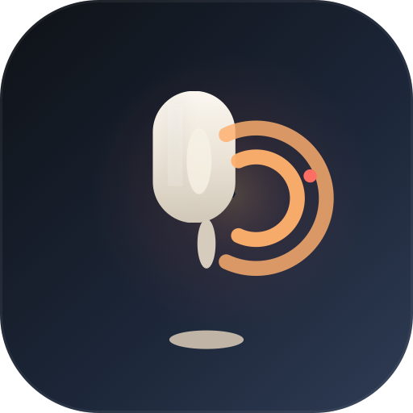

# LocalVoice 本地语音 | macOS Voice Dictation for Offline Speech-to-Text

LocalVoice is the **Mac dictation app that feels built in, not bolted on**. Press a hotkey, speak naturally, and keep working while your words appear in the active app.

Built for **Apple Silicon**, it runs fully on-device with **MLX + Qwen3-ASR** so you get **offline speech-to-text**, **Chinese and English dictation**, and **private local ASR** without sending audio to the cloud.

If you want a **menu bar voice input tool for Mac** that is quick to launch, private by default, and good enough for daily use, LocalVoice is made for that job.

[中文说明](README.zh-CN.md)

[](LICENSE)
[](https://developer.apple.com/macos)
[](https://www.apple.com/mac/)
[](https://github.com/ml-explore/mlx)
[](README.zh-CN.md)



## Table of Contents

- [Overview](#overview)
- [Highlights](#highlights)
- [Support the Project](#support-the-project)
- [Install](#install)
- [First Run](#first-run)
- [Configuration](#configuration)
- [FAQ](#faq)
- [Development](#development)
- [Project Layout](#project-layout)
- [License](#license)

## Overview

LocalVoice turns your Mac into a lightweight dictation tool that feels built into the system:

- Hold a hotkey, speak naturally, release, and the text appears in the focused app
- Transcribe Chinese, English, or mixed-language speech locally on device
- Choose Qwen3-ASR 0.6B for speed or 1.7B for higher accuracy
- Use native text injection first, with clipboard fallback where needed
- Keep voice data on your Mac instead of sending it to a remote API

<table>
  <tr>
    <td><strong>Press</strong><br>Hold Fn / Globe or a custom hotkey.</td>
    <td><strong>Speak</strong><br>Dictate in Chinese, English, or both.</td>
    <td><strong>Keep going</strong><br>Text lands in the app you are already using.</td>
  </tr>
</table>

## Use Cases

- Write emails, notes, tickets, and documents without switching away from the keyboard
- Capture ideas quickly while they are still in your head
- Dictate in Chinese, English, or mixed language with one workflow
- Keep sensitive speech local for work, study, or personal use

## Why Choose LocalVoice

Choose LocalVoice if you want a dictation app that is:

- **Instant** - no browser, no account, no cloud round-trip
- **Private** - transcription stays on your Mac
- **Focused** - one job, one workflow, one hotkey

| Compared with | LocalVoice advantage |
| --- | --- |
| Cloud dictation | No audio round-trip, no waiting on network, no cloud policy risk |
| Browser-based tools | No tab switching, no web app friction, no login loop |
| Generic OS dictation | Better bilingual flow and a dedicated menu bar workflow |
| Heavy AI assistants | Does one job well: turn speech into text, fast |
| Per-app hotkeys | Works across apps with a single, consistent push-to-talk flow |

## Highlights

| Area | What LocalVoice does |
| --- | --- |
| Offline ASR | Runs transcription fully on device with MLX |
| Privacy | No audio leaves your Mac during dictation |
| Bilingual input | Supports Chinese, English, and mixed speech |
| Hotkey workflow | Push-to-talk with Fn / Globe or a custom hotkey |
| Text injection | Uses Accessibility first, clipboard fallback second |
| Model management | Download, resume, verify, and delete local models |
| Local rewriting | Optional cleanup with a local LLM |
| Menu bar UI | Lightweight status and quick actions |

## Support the Project

If LocalVoice saves you time, there are a few simple ways to support it:

- Star the repository so more people can find it
- Share it with friends or teammates who need offline dictation on Mac
- Support development through the Donate tab inside the app

<p align="center">
  
</p>

Donations help cover development time, model testing, and ongoing maintenance.

## Install

### Requirements

- macOS 26 or later
- Apple Silicon only: M1, M2, M3, M4, or newer
- Microphone, Accessibility, and Input Monitoring permissions
- About 860 MB disk and 1.5 GB RAM for the 0.6B model
- About 1.8 GB disk and 3.5 GB RAM for the 1.7B model

### Option 1: Download the DMG

Download `LocalVoice.dmg` from the [Releases page](https://github.com/localvoice/local-llm-voice-input/releases), open it, and drag `LocalVoice.app` to `Applications`.

If macOS blocks first launch:

```bash
xattr -dr com.apple.quarantine /Applications/LocalVoice.app
```

### Option 2: Build from source

```bash
git clone https://github.com/localvoice/local-llm-voice-input.git
cd local-llm-voice-input
./build.sh
```

## First Run

1. Launch **LocalVoice** from `~/Applications`
2. Grant **Microphone**, **Accessibility**, and **Input Monitoring**
3. Download a model in **Settings → Model**
4. Hold **Fn / Globe** and speak
5. Release the key to insert the transcription

## Configuration

### Hotkey

Open **Settings → General** to change the hotkey used for push-to-talk.

### Model

Open **Settings → Model** to download or switch between:

| Model | Best for | Size | Notes |
| --- | --- | --- | --- |
| Qwen3-ASR 0.6B | Fast dictation | ~860 MB | Lightweight and responsive |
| Qwen3-ASR 1.7B | Higher accuracy | ~1.8 GB | Recommended for most users |

Download sources:

- HuggingFace
- HF Mirror
- ModelScope

### Text Input

LocalVoice uses Accessibility-based text injection first and falls back to clipboard paste when necessary. This is intended for app compatibility, especially in Electron-based apps.

### Language

The UI supports English and Chinese. Speech recognition itself can handle Chinese, English, and mixed-language input.

## FAQ

### Does transcription run offline?

Yes. Transcription runs locally on your Mac. Only model downloads require network access during setup.

### Which Macs are supported?

The current build target is macOS 26+ on Apple Silicon.

### Which model should I choose?

Use 0.6B if you want the lightest model and fastest response. Use 1.7B if you want the best accuracy for day-to-day dictation.

### Why does the app need these permissions?

- Microphone: capture audio for transcription
- Accessibility: insert text into the focused app
- Input Monitoring: listen for the global hotkey

## Development

### Common Commands

```bash
./build.sh
./build.sh --build-only
./build.sh --dmg
./test.sh
./test_transcribe.sh
swift test
```

### Project Layout

- `Sources/App` - app lifecycle and shared state
- `Sources/UI` - menu bar, onboarding, settings, and overlays
- `Sources/Audio` - recorder and transcription orchestration
- `Sources/Config` - permissions, locale, logging, and design tokens
- `Sources/Assets.xcassets` - app icon and asset catalog
- `Tests/VocalTypeTests` - unit and integration tests

## Notes

- Model downloads require network access during setup.
- The repository currently targets macOS 26+, so earlier versions are not supported.

## License

Apache 2.0. See [LICENSE](LICENSE).
